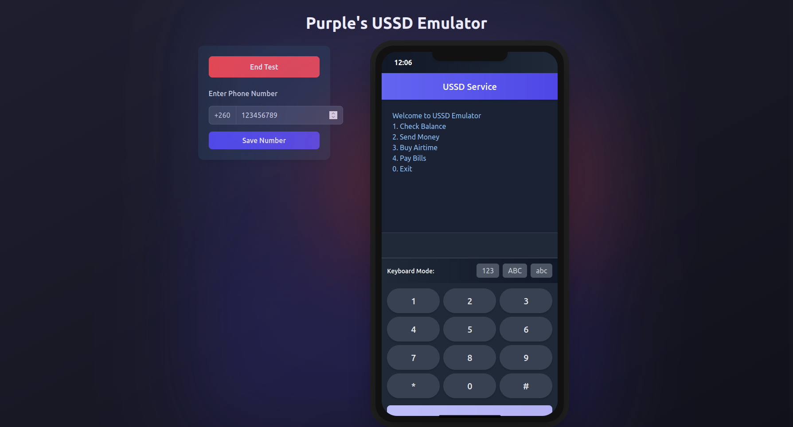

# USSD Emulator



A web-based USSD emulator built with Phoenix LiveView and styled with Tailwind CSS using the Catppuccin Mocha color scheme. This emulator allows developers to test USSD applications without needing a physical device or telecom integration.

## Features

- **Phone-like Interface**: Realistic mobile phone interface with status bar, screen, and keypad
- **Multiple Keyboard Modes**: Switch between numeric (123), uppercase (ABC), and lowercase (abc) keyboards
- **Dark Mode**: Beautiful dark mode interface using Catppuccin Mocha color scheme
- **Responsive Design**: Works on desktop and mobile devices
- **Session Management**: Maintains session state for USSD interactions
- **API Integration**: Connects to backend USSD services via API

## Getting Started

### Prerequisites

- Elixir 1.14 or later
- Phoenix 1.7 or later
- Node.js 14 or later (for asset compilation)

### Installation

1. Clone the repository

   ```bash
   git clone https://github.com/M4G3N74/Phoenix-ussd-emulator.git
   cd Phoenix-ussd-emulator
   ```

2. Install dependencies

   ```bash
   mix setup
   ```

3. Start the Phoenix server

   ```bash
   mix phx.server
   ```

4. Visit [`localhost:4000`](http://localhost:4000) in your browser

## Usage

### Basic Operation

1. The emulator starts with a pre-filled phone number (260123456789)
2. Dial a USSD code using the keypad (supported codes: \*123#, \*456#, \*789#)
3. Press the SEND button to submit the code
4. Follow the on-screen prompts and respond using the keypad
5. Press SEND after each response

### Keyboard Modes

- **123**: Numeric keypad for entering numbers
- **ABC**: Uppercase letters keypad
- **abc**: Lowercase letters keypad

### Session Management

- Click "End Test" to reset the session and start over
- The emulator maintains session state between requests

## API Integration

The emulator connects to a backend API endpoint at `/api/ussd`. The API expects and returns JSON in the following format:

### Request

```json
{
  "phoneNumber": "260123456789",
  "sessionId": "random_session_id",
  "text": "1",
  "ussdCode": "*123#"
}
```

### Response

```json
{
  "message": "CON Select an option:\n1. Check balance\n2. Apply for loan\n3. Repay loan"
}
```

Messages starting with "CON" indicate that the session continues, while messages starting with "END" indicate that the session should terminate.

## Customization

### Adding New USSD Codes

To add support for new USSD codes, modify the `UssdEmulator.Ussd.Service` module to handle the new codes:

```elixir
def process_ussd_code("*new_code#") do
  "CON Welcome to the new service\n1. Option One\n2. Option Two"
end
```

Then update the frontend to recognize the new code in the `callUssdService` function.

### Styling

The emulator uses Tailwind CSS with the Catppuccin Mocha color scheme. You can customize the appearance by modifying the Tailwind configuration in `assets/tailwind.config.js`.

## Development

### Project Structure

- `lib/ussd_emulator_web/live/ussd_emulator_live.ex`: LiveView controller
- `lib/ussd_emulator_web/live/ussd_emulator_live.html.heex`: LiveView template
- `lib/ussd_emulator/ussd/service.ex`: USSD service logic
- `lib/ussd_emulator_web/controllers/ussd_controller.ex`: API controller

### Adding Features

1. Fork the repository
2. Create a feature branch (`git checkout -b feature/amazing-feature`)
3. Commit your changes (`git commit -m 'Add some amazing feature'`)
4. Push to the branch (`git push origin feature/amazing-feature`)
5. Open a Pull Request

## Deployment

The USSD emulator can be deployed to any platform that supports Phoenix applications. For production deployment, please refer to the [Phoenix deployment guides](https://hexdocs.pm/phoenix/deployment.html).

## License

Distributed under the MIT License. See `LICENSE` for more information.

## Acknowledgements

- [Phoenix Framework](https://www.phoenixframework.org/)
- [Tailwind CSS](https://tailwindcss.com/)
- [Catppuccin](https://github.com/catppuccin/catppuccin)
- [Font Awesome](https://fontawesome.com/)
- [jQuery](https://jquery.com/)
